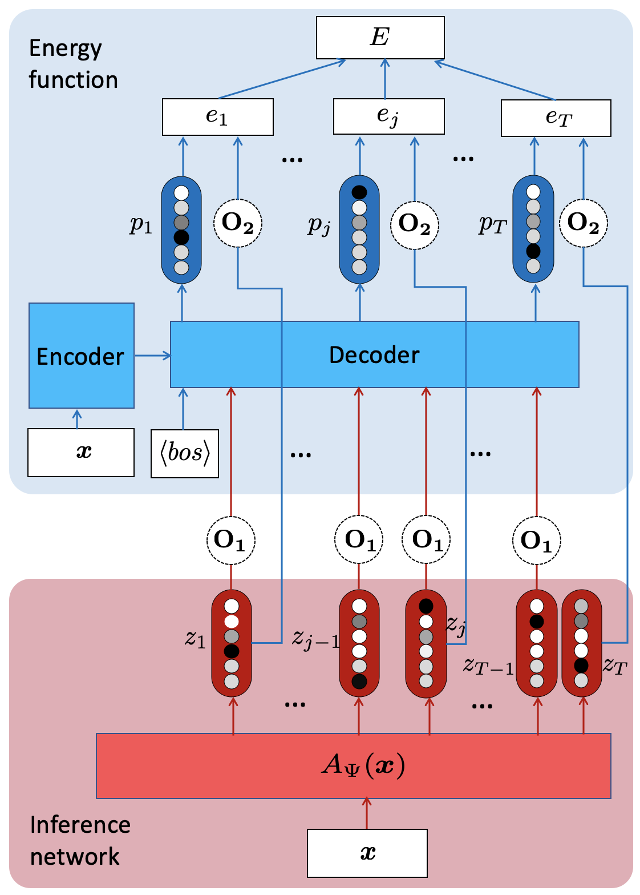

# ENGINE

Code to train model from "[ENGINE:Energy-Based Inference Networks for Non-Autoregressive Machine Translation](https://ttic.uchicago.edu/~lifu/papers/ENGINE.pdf)", accept by ACL2020. Our code is based on the code of [Mask-Predict](https://github.com/facebookresearch/Mask-Predict) from Facebook AI Research.

<p align="center">
 
</p>

We propose to train a non-autoregressive machine translation model to minimize the energy defined by a pretrained autoregressive model.In particular, we view our non-autoregressive translation system as an [inference network (Tu and Gimpel, 2018)](https://arxiv.org/abs/1803.03376) trained to minimize the autoregressive teacher energy. This contrasts with the popular approach of training a non-autoregressive model on a distilled corpus consisting of the beam-searched outputs of such a teacher model. Our approach, which we call **ENGINE (ENerGy-based Inference NEtworks)**, achieves state-of-the-art non-autoregressive results on the IWSLT 2014 DE-EN and WMT 2016 RO-EN datasets, approaching the performance of autoregressive models.

## Download models 

The pretrained AR (autogressive) transformer models, the dictionaries and [CMLM](https://github.com/facebookresearch/Mask-Predict) (conditional masked language models) could be download. These models are used for **[ENGINE](https://ttic.uchicago.edu/~lifu/papers/ENGINE.pdf)** training. By the way, the scripts to train these model are also provides in the end.

And let me know if you are interested in the **ENGINE** trained in the paper. I do not share the models here because of disk space limitation.

* **IWSLT14 German-English**
```
wget https://ttic.uchicago.edu/~lifu/ENGINE_IWSLT14DEEN.zip 
```


* **IWSLT14 German-English**
```
wget https://ttic.uchicago.edu/~lifu/ENGINE_WMT16ROEN.zip
```


## Data
1. IWSLT'14 German to English (DE-EN) can be obtained with scripts provided in [fairseq](https://github.com/pytorch/fairseq/blob/master/examples/translation/prepare-iwslt14.sh).
2. WMT'16 Romania to English (RO-EN) can be obtained from [here](https://github.com/nyu-dl/dl4mt-nonauto#downloading-datasets--pre-trained-models).


## Preprocess
Here are two examples how to preprocess the datasets. Please check the scripts in detail. Note that, in our project, we also preprocess the pseudocorpus. The beam search outputs from the pretrained autoregressive models are used in this project.  

* **IWSLT14 German-English**
```
sh preprocess_iwslt14.sh
```

* **IWSLT14 German-English**
```
sh preprocess.sh
```


## Train ENGINE
`train_ENGINE.sh` or `train_ENGINE_iwslt.sh` is used for **ENGINE** training:

```
mkdir -p $output_dir; cp ENGINE_WMT16ROEN/$Pretrained_cmlm  $output_dir/checkpoint_last.pt
python train_inf.py   \
    PATH_YOUR_OUTPUT/$text  --always-mask   --energy_file  ENGINE_WMT16ROEN/$energy  \ 
    --infnet-toE-feed-type 0  --feed-type 0   --arch bert_transformer_seq2seq  
    --share-all-embeddings --update-freq 8   --reset-optimizer  --criterion  Inf_Energy_Loss \
    --label-smoothing 0.1 --lr 0.000001   --alpha 0   --optimizer adam --adam-betas '(0.9, 0.999)'
    --task translation_inf --max-tokens 1024 --weight-decay 0.01 --dropout 0.1 \
    --encoder-layers 6 --encoder-embed-dim 512 --decoder-layers 6 --decoder-embed-dim 512  \
    --max-source-positions 10000 --max-target-positions 10000 --max-update 300000 --seed 0 \
    --save-dir  $output_dir
```


## Evaluation
one decoding iteration is used (meaning the methods are purely non-autoregressive)
```
python generate_cmlm.py ${output_dir}/data-bin  --path ${model_dir}/checkpoint_best.pt  --task translation_self --remove-bpe --max-sentences 20 --decoding-iterations 1  --decoding-strategy mask_predict
```


## Others

The following scrips could be used to train your own models: the pretrained AR(autogressive) transformer models and CMLM.
#### Train transformer AR(autogressive) energy models
You could use the script `train_AR_Energy.sh` or `train_iwslt_AR_Energy.sh` to train your owm transformer AR(autogressive) energy models.


#### Train CMLM (conditional masked language models)
The script `train_CMLM.sh` shows an example how to train CMLM.


## Issues or Thoughts
For any issues or thoughts about **ENGINE** in the Github, please contact Lifu Tu ( `lifu@ttic.edu` ). 


## To-do 
The code version of [OpenNMT-py](https://github.com/OpenNMT/OpenNMT-py) for **ENGINE** will be also provide soon.


## References
```
@inproceedings{tu-2020-nat,
    title = {{ENGINE}: Energy-Based Inference Networks for Non-Autoregressive Machine Translation},
    author = "Tu, Lifu and Pang, Richard Yuanzhe and Wiseman, Sam and Gimpel, Kevin",
    booktitle = "Proceedings of the 58th Annual Meeting of the Association for Computational Linguistics",
    year = "2020",
    publisher = "Association for Computational Linguistics",
}
```


